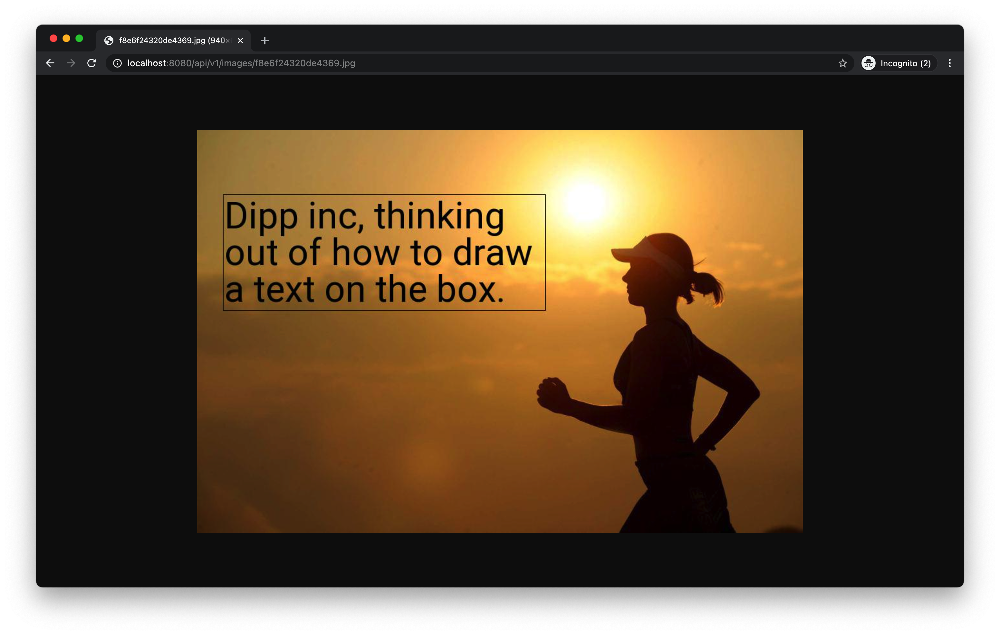

## About

The point of this exercise is to give you the chance to show us what you know,
can do and how you approach problem-solving.

For this exercise to be useful, we can't have solutions from the internet.
This should go without saying, but please do not distribute or share this exercise to anyone in any form.

When you feel you are ready, please email us your code solution and how we can run it.
**In your email you must include that this is your original work and was completed only by you.**

## Project setup

This assumes that you already have `Python3` and `virtualenv` installed on your computer, and
you run the following commands in the project folder.

1. Create and activate a virtual environment

    ```shell
    virtualenv -p python3 <name of virtualenv>
    source <name of virtualenv>/bin/activate
    ```

2. Install the requirements

    ```shell
    pip install -r requirements.txt
    ```

3. Run the server

    ```shell
    python manage.py run
    ```

4. Get all routes

    ```shell
    python manage.py routes
    ```

## Part I

### Draw a text box inside the image

In this part, we want you to determine the suitable font size that will make the **content** fit inside
a predefined box based on a particular font, and draw this **text box** on an image provided by user.

We should be able to make the request to this endpoint: `[POST] /api/v1/draw/`,
The code to this endpoint is located inside the file: `./app/controllers/image.py`

The input data should look like this:

```json
{
    "font_url": "https://storage.googleapis.com/dipp-massimo-development-fonts/4f2cf2b6b99d96ca.ttf",
    "image_url": "https://storage.googleapis.com/dipp-massimo-development-images/1f1282fef735f349.jpg",
    "text": {
        "content": "Dipp inc, thinking out of how to draw a text on the box.",
        "text_color": "#000000",
        "border_color": "#000000"
    },
    "box": {
        "x": 40,
        "y": 100,
        "width": 500,
        "height": 180
    }
}
```

The API should respond with an output similar to the following:

```json
{
    "resource": "http://localhost:8080/api/v1/images/12c1fe1cf860400c.jpg",
    "splits": [
        {
            "content": "Dipp inc, thinking",
            "font_size": 57,
            "x": 40,
            "y": 100
        },
        {
            "content": "out of how to draw",
            "font_size": 57,
            "x": 40,
            "y": 157
        },
        {
            "content": "a text on the box.",
            "font_size": 57,
            "x": 40,
            "y": 214
        }
    ],
    "box": {
        "height": 180,
        "width": 500,
        "x": 40,
        "y": 100
    }
}
```

As you may have noticed, you may need to break the **content** into multiple lines or splits to fit a box.

### Get one image from the server

You need to use previous API `[POST] /api/v1/draw/` to generate an image and save it
to the file system. Afterwards, users can get an image by the url link located in the server.

We should be able to make the request to this endpoint: `[GET] /api/v1/images/<filename>/`,
The code to this endpoint is located inside the file: `./app/controllers/image.py`

It will look like this:



### Write test cases for your endpoints

Eventually, you need to write test cases to make sure your endpoints work expected, and they 
should include success (2xx) and failure (4xx) cases.

You can implement test cases inside the folder: `./tests`, and the following failure examples are for your reference:

#### API errors

```shell
http GET 'http://localhost:8080/api/v1/hello'

HTTP/1.0 404 NOT FOUND
Content-Length: 65
Content-Type: application/json

{
    "code": 404,
    "message": "Nothing matches the given URI"
}
```

```shell
http PUT 'http://localhost:8080/api/v1'

HTTP/1.0 405 METHOD NOT ALLOWED
Content-Length: 81
Content-Type: application/json

{
    "code": 405,
    "message": "Specified method is invalid for this resource"
}
```

#### Endpoint errors

```shell
printf '{
    "font_url": "https://storage.googleapis.com/dipp-massimo-development-fonts/4f2cf2b6b99d96ca.ttf",
    "image_url": "https://storage.googleapis.com/dipp-massimo-development-images/1f1282fef735f349.jpg",
    "text": {
        "content": "Use wrong params"
    },
    "box": {
        "x": 40,
        "y": 100
    }
}' | http POST 'http://localhost:8080/api/v1/draw' Content-Type:'application/json'

HTTP/1.0 400 BAD REQUEST
Content-Length: 67
Content-Type: application/json

{
    "code": 400,
    "message": "Please inspect your params or query valid"
}
```

```shell
printf '{
    "font_url": "https://not-found.ttf",
    "image_url": "https://not-found.jpg",
    "text": {
        "content": "Use wrong urls",
        "text_color": "#000000",
        "border_color": "#000000"
    },
    "box": {
        "x": 40,
        "y": 100,
        "width": 500,
        "height": 180
    }
}' | http POST 'http://localhost:8080/api/v1/draw' Content-Type:'application/json'

HTTP/1.0 400 BAD REQUEST
Content-Length: 68
Content-Type: application/json

{
    "code": 400,
    "message": "Can not get file's data from url"
}
```

```shell
printf '{
    "font_url": "https://storage.googleapis.com/dipp-massimo-development-fonts/4f2cf2b6b99d96ca.ttf",
    "image_url": "https://storage.googleapis.com/dipp-massimo-development-images/1f1282fef735f349.jpg",
    "text": {
        "content": "Box is too small",
        "text_color": "#000000",
        "border_color": "#000000"
    },
    "box": {
        "x": 40,
        "y": 100,
        "width": 5,
        "height": 5
    }
}' | http POST 'http://localhost:8080/api/v1/draw' Content-Type:'application/json'

HTTP/1.0 400 BAD REQUEST
Content-Length: 68
Content-Type: application/json

{
    "code": 400,
    "message": "Can not make a text fit in a box"
}
```

## Part II

In this part, we will ask you to come in and elaborate your code.

## Important notes:

- There is no **right** or **wrong** answer. We are interested in how you approach problem-solving.
- Please fill free to use any library you want but don't forget to add it in `requirements.txt`
- Please fill free to refactor the code if the structure does not fit your needs.
- Please don't hesitate email us if you have any questions.

## Good luck !!!
